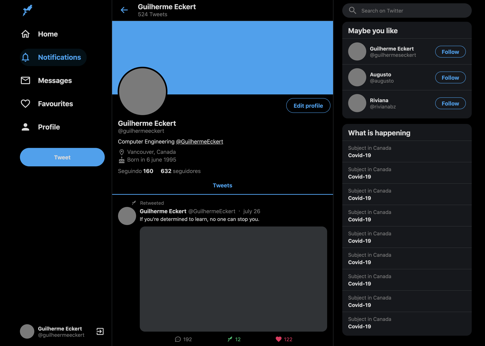

# **Twitter Clone**


<p align="center">
  
</p>

<p align="center">
  
  
</p>

Responsive Twitter clone for study purposes.
 
 <p align="center">
  
</p>


</div>

<h4 align="center"> 
	🚧  React Select 🚀 Under construction ...  🚧
</h4>


## 🛠 Technology

The following tools were used in the construction of the project:

- [Node.js](https://nodejs.org/en/)
- [React](https://pt-br.reactjs.org/)
- [TypeScript](https://www.typescriptlang.org/)
- 

## Features

- [x] User signIn
- [x] Reserve


### Prerequisites

Before you begin, you will need to have the following tools installed on your computer:

 - [Git](https://git-scm.com) 
 - [Node.js](https://nodejs.org/en/)
  
In addition, it is good to have an editor to work with the code like

 - [VSCode](https://code.visualstudio.com/)


## Project


- [Figma](https://www.figma.com/file/cjNh1bd93pbJBFOza25K7L/Twitter-Clone?node-id=1%3A2)


#### Dependencies

- Styled-components
- Styled-icons
- React-sticky-box


### 🎲 Running the the project

``` bash
# Clone this repository
$ git clone <https://github.comguilhermeseckert GoBarber>

# Access the project folder in the / cmd terminal
$ cd TWITTER-CLONE

# Install the dependencies
$ yarn

# Run the application in development mode
$ yarn start

```
  


---
Made with by Guilherme S.Eckert :wave: [Get in touch!](https://www.linkedin.com/in/guilherme-eckert/)


